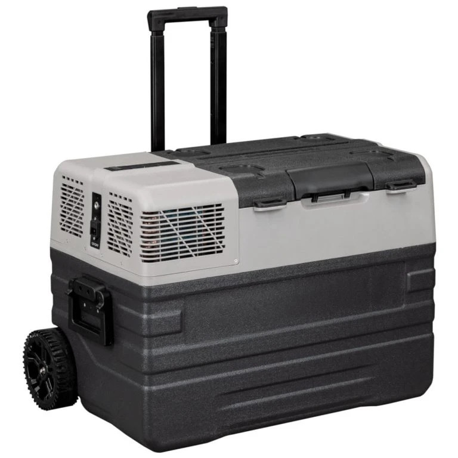

## About Alpicool manufactured fridges

[Alpicool](https://www.alpicool.com/) is a Chinese manufacturer that makes eg. portable fridges.
These exactly same fridges are sold around the World with many different brands. Eg. I myself have
a "Frezzer" branded one, but it is clearly an Alpicool NX42. I have seen at least 8 different brands.

The Bluetooth protocol of these fridges has been reverse engineered and
[Ben Peddell has documented it](https://github.com/klightspeed/BrassMonkeyFridgeMonitor).

Because I have a version without freezer unit, I could not implement support for them, because it 
most likely would have caused some bugs when I don't have accurate data for to debug against.
So at the moment there's support for fridges without freezer only and only one at a time.

Example photo of a similar fridge as mine:

