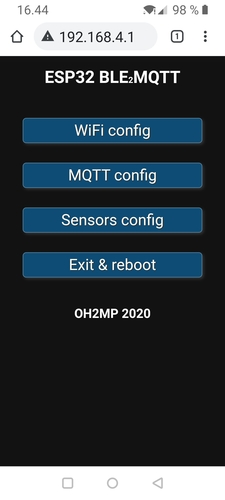
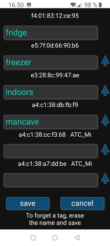
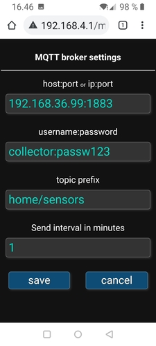

# OH2MP ESP32 BLE2MQTT

### An ESP32 based gateway that listens BLE beacons and sends the data via MQTT

Web-configurable BLE data collector that sends data to a MQTT broker. In my own configuration I have
Mosquitto as a broker and InfluxDB + Telegraf with MQTT plugin. See [CONFIG_EXAMPLES.md](CONFIG_EXAMPLES.md). 

This software sends data as JSON to the broker. The data is specified to be compact to avoid high bills
when this is used with a mobile internet with some data plan. See [DATAFORMATS.md](DATAFORMATS.md)

The idea for this is home or RV use, not scientific environment. Because of that eg. the temperatures are 
only with 0.1°C precision and acceleration sensors of Ruuvi tags are simply ignored. It's not very
important to know the acceleration while the tag is in a fridge and we want to keep data compact.

BLE beacons that are currently supported:

- [Ruuvi tag](https://ruuvi.com/) (Data format V5 aka RAWv2 only)
- [Xiaomi Mijia Bluetooth Thermometer 2 with ATC_MiThermometr firmware](https://github.com/atc1441/ATC_MiThermometer) (stock firmware not supported)
- [Inkbird IBS-TH2](https://inkbird.com/products/ibs-th2-temp) (version without humidity and external sensor)
- [Mopeka✓ gas tank sensor](https://www.mopeka.com/product-category/sensor/)
- [ESP32 Water sensor](https://github.com/oh2mp/esp32_watersensor)
- [ESP32 Energy meter](https://github.com/oh2mp/esp32_energymeter)
- [ESP32 MAX6675 beacon for thermocouples](https://github.com/oh2mp/esp32_max6675_beacon)
- [ESP32 DS18x20 beacon](https://github.com/oh2mp/esp32_ds1820_ble)
- [Alpicool portable fridges](https://www.alpicool.com) (most of the models, I believe. [Read more](Alpicool.md))

This is partly based on the same code as [OH2MP ESP32 Smart RV](https://github.com/oh2mp/esp32_smart_rv)
and [OH2MP ESP32 Ruuvicollector](https://github.com/oh2mp/esp32_ruuvicollector)

------

## Software prerequisities

- Some MQTT broker like Mosquitto running somewhere.
- [Arduino IDE](https://www.arduino.cc/en/main/software) – __The current tested IDE version is 2.3.2__
- [Arduino LITTLEFS uploader](https://github.com/earlephilhower/arduino-littlefs-upload) – Optional if you use the ready made image

### Libraries needed

Install these from the IDE library manager. I have added the versions which have tested and confirmed to be working.

- EspMQTTClient 1.13.3
- LittleFS_esp32 1.0.5 (1.0.6 won't compile, see https://github.com/lorol/LITTLEFS/issues/69)
- PubSubClient 2.8

## Installation and configuration

Choose correct ESP32 board and change partitioning setting:  **Tools -> Partition Scheme -> Huge APP(3MB No OTA)**

You can use the filesystem uploader tool to upload the contents of data library. It contains the html pages for
the configuring portal. Or you can just upload the provided image with esptool:

`esptool --chip esp32 --port /dev/ttyUSB0 --baud 921600 --before default_reset --after hard_reset write_flash -z --flash_mode dio --flash_freq 80m --flash_size detect 3211264 esp32_ble2mqtt.littlefs.bin`

By default the software assumes that there are maximum 16 beacons or tags, but this can be changed from the code,
see row `#define MAX_TAGS 16`

## Configuration option

The portal saves all configurations onto the LITTLEFS filesystem. They are just text files, so you can
precreate them and then your ESP32 Ruuvi Collector is preconfigured and you dont' have to use the portal
at all. Just place yout configuration files into the data/littlefs directory along the html files and 
upload them with ESP filesystem uploader.

See [FORMATS.md](FORMATS.md).

## LED behavior

Optionally an RGB LED can be connected to the board. It acts as a status indicator. At boot the LED
shows a short color effect to see that it's working. Colors and meanings in operating mode:

- off = nothing happening just now
- cyan = BLE scanning active, but no beacons heard yet
- blue = BLE beacon(s) heard
- purple = end of BLE scanning
- green = sending data to MQTT broker
- red = cannot connect to WiFi
- orange = WiFi connection works but cannot send data to MQTT broker

The LED pins are configurable from `#define` rows. The defaults are 21 red, 22 green and 23 blue.
Every one should be connected with a eg. 1kΩ resistor.

__TIP:__ connect an LDR to the cathode side of the LED. Then it will illuminate brighly in daylight
but will be dimmed in the dark. 

------

## Portal mode

If the GPIO0 is grounded (same as BOOT button is pressed), the ESP32 starts portal mode.
The pin can be also changed from the code, see row `#define APREQUEST 0`

In the start of portal mode the ESP32 is scanning 11 seconds for beacons. During the scan the color
behavior of the LED is similar like in operating mode.

WiFi AP is not listening yet at the scanning period. After the LED starts illuminating green, 
connect to WiFi **ESP32&nbsp;BLE2MQTT**, accept that there's no internet connection
and take your browser to `http://192.168.4.1/`

The web GUI should be self explanatory. 

It's a good idea to find out the Bluetooth MAC addresses of the beacons beforehand. For Ruuvi tags the
easiest way is to use Ruuvi software. For other beacons eg. 
[BLE Scanner by Bluepixel Technologies](https://play.google.com/store/apps/details?id=com.macdom.ble.blescanner)
is a suitable app for Android.

The portal mode has a timeout. The unit will reboot after 2 minutes of inactivity and the remaining time
is visible on the screen. This timeout can be changed from line #define APTIMEOUT
The LED changes its color slowly from green to yellow and then red depending how near the timeout is.

There's almost no sanity checks for the data sent from the forms. This is not a public web service and if 
you want to mess up your board or try to make a denial of service using eg. buffer overflows, feel free to 
do so.

### Sample screenshots from the portal

------

